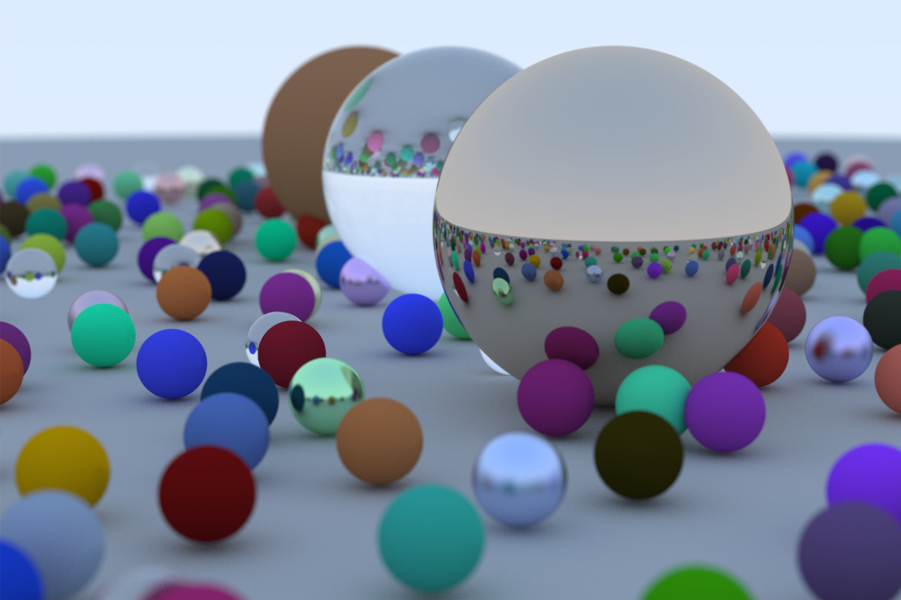
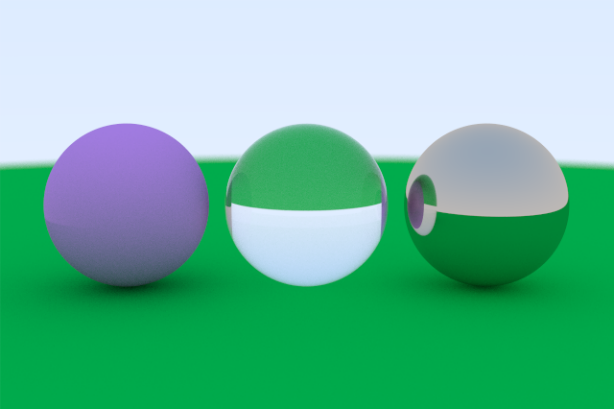

# Ray Tracing

## Description

A simple ray tracer written in C++ that features a positionable camera, a shape (sphere), various materials (diffuse, dielectric and metallic), anti-aliasing and defocus blur.

An image rendered by the ray tracer:



## Table of Contents

- [Installation](#installation)
- [Usage](#usage)
- [Credits](#credits)
- [License](#license)

## Installation

Follow the steps below to install the ray tracer:

1. Clone the repository

```shell
git clone https://github.com/rviu/ray-tracing.git
```

2. Run make inside the project directory

```shell
cd ray-tracing
make
```

## Usage

#### Random Scene

To render the image in the description of the project, run the following command in the project directory after installation:

```shell
./bin/main > image.ppm
```

This will output an image `image.ppm` in the project directory.

Note: it might take a long time for rendering depending on the system resources; try reducing the image resolution (see next section) for shorter render duration.

#### Custom Scene

To render a custom scene, follow the steps below:

1. Open `src/main.cpp` in a text editor of your choice

2. Comment out the line where the `world` is initialized and create a new `world` instead

```c
// auto world = random_scene();
hittable_list world;
```

3. Create a ground material of type `lambertian` and add a `sphere` to the world with this material type

```c
auto ground_material = std::make_shared<lambertian>(color(0.0, 0.604, 0.09));
world.add(std::make_shared<sphere>(point3(0, -100.5, 0), 100, ground_material));
```

4. Create three more spheres with `lambertian`, `dielectric` and `metallic` materials respectively and add them to the world.

```c
auto material_left = std::make_shared<lambertian>(color(0.674, 0.309, 0.776));
world.add(std::make_shared<sphere>(point3(-1.1, 0, -1), 0.5, material_left));

auto material_center = std::make_shared<dielectric>(1.5);
world.add(std::make_shared<sphere>(point3(0, 0, -1), 0.5, material_center));

auto material_right = std::make_shared<metal>(color(0.7, 0.6, 0.5), 0.0);
world.add(std::make_shared<sphere>(point3(1.1, 0, -1), 0.5, material_right));
```

5. Customize the camera positioning and the distance to focus

```c
point3 lookfrom(0, 1.25, 6);
point3 lookat(0, 0, -1);
```

```c
double dist_to_focus = (lookfrom - lookat).length();
```

6. Customize the image properties

```c
const double aspect_ratio = 3.0 / 2.0;
const int image_width = 640;
```

7. Build the project and render the image as before

```shell
make
./bin/main > image.ppm
```

This will output the following image:



## Credits

[_Ray Tracing in One Weekend_](https://raytracing.github.io/books/RayTracingInOneWeekend.html)

## License

MIT License
